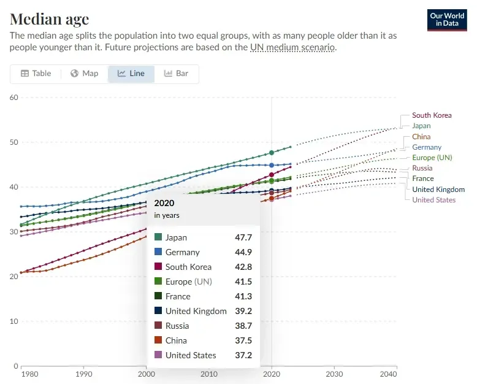
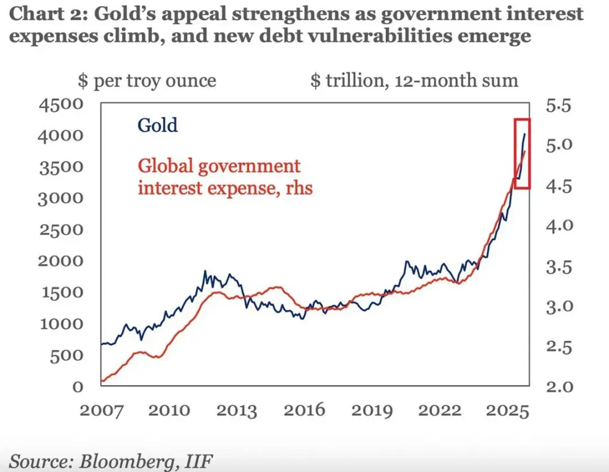

# 全球老龄化对经济的影响

对于全球经济来说，看似关键的是人工智能AI的发展和兑现度，背后还是这张表

从年龄中位数来看，主要经济体都步入中老年阶段了。
日本想要走出阴霾，但它的人口年龄并非顺风，去年中位数已近50岁。韩国和德国都超过了45岁。
欧盟整体比中国老2.7岁，虽然中国也超过了40岁。欧盟的弱点是面临更严峻的养老负担（并非因为更老，实际上2034年开始会互换，而是更..）
这代表留给所谓的新经济时间，并不宽裕。而在这个发力时间里，各主要经济体的债务仍会膨胀，不管以什么理由，积极财政也好、国防也罢——

无一例外，全球处于债务连锁危机的早期，或者已是中期。（比如日债风波很容易外溢到全球资产）
不断出现的地缘摩擦，只是债务压力的“一种变形”，它从叙事上可以管理成一种资产配置（便于控制），但当它继续发展至末期时，破坏力是不分资产形态的。
驾驭或许本来就不是一个好主意。