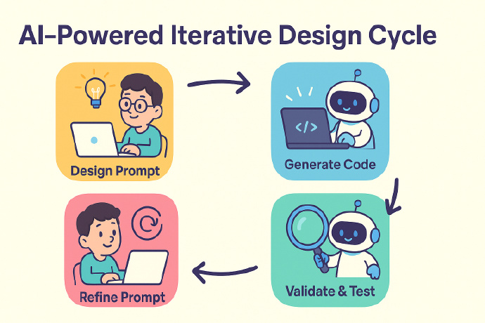

# AI 编程

## 关键技能
> GenAI 应用工程师

1. 善于灵活运用AI“积木”快速搭建应用；
2. 熟练使用AI辅助编码工具实现快速开发。

### AI“积木”
- 计算机基础
  - 异步编程
  - 安全防护措施（guardrails）
- AI 能力
  - 提示工程
  - 模型评估方法（evals）
  - 模型选型
  - 智能体框架（agentic frameworks）
  - MCP（模型控制协议）
- 进阶
  - 向量数据库（embeddings/vectorDBs）
  - 模型微调（fine-tuning）
  - 图数据库与LLM结合使用（graphDBs）
  - 数据提取
  - 检索增强生成（RAG）


### AI 辅助编码工具
[工具列表](./AI_tool.md)

## 获取AI领域最新进展
- 订阅并定期阅读专业资讯（如The Batch）
- 持续参与高质量的短期培训课程
- 经常进行项目实战训练，保持实践能力


# AI 编程

如何让 AI 真正理解项目需求并生成高质量、一致性的代码？
构建一套系统化的 AI 协作规范

- 如何让 AI 准确理解业务逻辑和技术要求
- 如何确保生成代码的架构一致性和质量标准
- 如何在团队中推广和维护统一的开发模式
- 如何避免规范冲突和维护成本过高的问题

## Rules 设计理念

[新版本采用清晰的三层架构，每层都有明确的职责和边界](./AI_tool_pic/new_rules_design.png)

### 标准化规则格式

```md
# 规则名称

## 基础规范

- 明确的技术要求和实现标准

## 强制行为

- 必须执行的具体操作和约束

## 禁止行为

- 严格禁止的操作和做法，需要避免的常见错误

## 示例代码

- 具体的代码示例和最佳实践
- 也通过 [文件名](mdc:路径) 引用外部示例
```

### 明确的 AI 协作协议提示词

[AI 协作协议提示词](./AI_tool_pic/ai_portal_prompt.png)

```md
# AI 协作执行规则

## 规则分类

- basic/下的通用规则: 必须调用，通用基础规范
- modules/下的模块规则: 按需调用，架构分层规范
- workflow/下的流程规则: 按需调用，业务场景规范

## 执行流程

1. 识别场景 → 调用相关规则
2. 读取示例代码 → 作为生成参考
3. 执行强制/禁止行为 → 确保代码质量
4. 应用设计原则 → 组件化、单一职责、分层设计

## 质量保障

- 所有规则必须 100%执行，重点关注强制行为和禁止行为
```

## 三层结构

- 基础层精细化设计
- 模块层的分层设计
- 流程层的场景化设计

### 基础层精细化设计

|      文件名      |      职责       |          核心内容          |
| :--------------: | :-------------: | :------------------------: |
|    basic.mdc     |  项目基础规范   | 目录结构、技术栈、开发流程 |
| code-quality.mdc |  代码质量控制   |   复杂度限制、安全性要求   |
|      ts.mdc      | TypeScript 规范 |   类型定义、严格模式配置   |
|   comment.mdc    |    注释规范     |   JSDoc 格式、文件头注释   |
|  code-names.mdc  |    命名规范     |  变量、函数、组件命名约定  |
|    style.mdc     |    样式规范     |     CSS/Less 编写标准      |
|     lint.mdc     |    代码检查     |   ESLint、Prettier 配置    |

`code-quality.mdc` 代码质量

```md
# 代码质量分规范（通用规则）

## 强制行为

- 所有请求必须采用 HTTPS 协议
- 确保第三方库安全可靠

## 禁止行为

- 代码复杂度限制
  - 单个文件不得超过 500 行
  - 条件复杂度不得超过 10
  - 单个函数不得超过 199 行
  - 超过限制时，应优先按功能模块拆分为多个函数或文件
- 禁止使用非得物域名的外部 CDN 资源
- 禁止在代码中包含明文密码或硬编码 token
- 禁止出现敏感词
- 避免重复代码块
- 不允许单词拼写错误或不符合命名规范
- 避免在前端直接进行金额计算(导致精度丢失)
- 禁止使用魔数(如 a === '3')，应使用常量(如 a === statusMap.login)
```

### 模块层的分层设计

模块层的设计遵循前端分层架构思想，将复杂的应用拆分为职责明确的模块：

- 表现层： `components.mdc`（组件规范）、`pages.mdc`（页面规范）
- 业务逻辑层： `hooks.mdc`（状态管理）、`utils.mdc`（工具函数）
- 数据服务层： `service.mdc`（API 接口）、`constants.mdc`（配置管理）
- 路由层： `route.mdc`（路由配置和导航）

服务层规范（`service.mdc`）规范定义了 API 接口的标准化开发流程：

```md
# API 接口生成规范（模块规则）

## 存放位置规范（按优先级）

- [p0] 页面级 API：src/pages/{pageName}/services/{modules}.ts
- [p1] 全局 API：src/services/{modules}.ts
- 类型文件：对应的 .interface.ts 文件

## 标准代码模板

"""
import { request } from '@/utils/request';
import { UniversalResp } from '@/utils/request-operation';
import { IUserListReq, IUserListDataRes } from './interface';

/\*\*

- 获取用户列表
- @param data 请求参数
  \*/
  export const fetchUserListApi = async (data: IUserListReq) => {
  return
  request.post>(
  '/api/user/list',
  data
  );
  };
  """

## 强制行为

- 使用 MCP Server 的 mooncake_get_api_details 工具获取接口详情
- 响应数据必须使用 UniversalResp<T>泛型包装
- 接口命名采用 fetch{ApiFileName}Api 格式
- 类型定义必须完整，包含完整字段注释
```

### 流程层的场景化设计

针对具体业务场景定制化规范，将复杂的业务场景标准化。
| 流程文件 | 业务场景 | 核心功能 |
| :----------------: | :---------------: | :------------------------: |
| curd-page.mdc | curd 页面开发 | curd 页面完整使用流程 |
| log.mdc | 错误监控 | APM 监控和错误日志处理流程 |
| send-buried.mdc | 数据埋点 | 用户行为埋点的标准流程 |

`curd-page.mdc` 定义了完整的表格页面开发流程：


```md
# pro-table 生成新页面（流程规则）

深入研究代码并理解[insert feature]是如何工作的。一旦你明白了，让我知道，我将提供我的任务给你。

## 工作流程

按以下流程进行任务执行，如果评估存在非必须流程，可跳过。

- MCP 读取接口信息
- 从用户输入中提取以下信息：
  - 列表名称
  - 筛选项（需标记 hideInTable）
  - 展示项（需标记 hideInSearch）
  - 操作项
  - 工具栏按钮
- 评估完整的需求内容复杂度，考虑未来的扩展性，合理设计分层目录结构
  - 各个模块保持单一职责，考虑合理的业务组件拆分，避免大量代码都在页面主入口文件
  - 使用命令行批量创建目录文件（包含各类文件 ts、tsx、less 等）
  - 文件暂不生成代码
- 配置页面的路由信息
- 生成类型文件，确保所有类型定义清晰
- 生成 constants 文件，定义所需常量
- 生成 services 文件，实现数据服务
- 生成所需的 hooks 文件
- 生成页面（必需）和 components（如需）文件 完成 UI 层

## 强制行为

- 使用 pro-table 进行开发，包括筛选表单，符合最佳实践
- 筛选项和列表项配置创建 useColumns.tsx 声明，筛选项（需标记 hideInTable）、展示项（需标记 hideInSearch）
- 左侧字段按需固定，操作项右侧固定，最多显示两个，超出折叠显示
- 文本左对齐，数字右对齐，状态枚举居中显示
- 分页设置支持 10、20、50、100
- .....

# 禁止行为

.....
```

## 最佳实践

1. 创建基础架构

```md
.cursor/rules/
├── ai.mdc # AI 协作总纲
├── basic/ # 基础规范目录
│ ├── basic.mdc
│ ├── code-quality.mdc
│ ├── ts.mdc
│ ├── style.mdc
│ ├── comment.mdc
│ ├── code-names.mdc
│ └── lint.mdc
├── modules/ # 模块规范目录
│ ├── components.mdc
│ ├── pages.mdc
│ ├── hooks.mdc
│ ├── service.mdc
│ ├── constants.mdc
│ ├── utils.mdc
│ └── route.mdc
└── workflow/ # 流程规范目录
├── curd-page.mdc
├── log.mdc
└── send-buried.mdc
└── ......
```

2. 配置 AI 协作协议，在 `ai.mdc` 中定义核心协作规则

```md
# AI 协作执行规则

## 规则分类

- basic/下的通用规则: 必须调用，通用基础规范
- modules/下的模块规则: 按需调用，架构分层规范
- workflow/下的流程规则: 按需调用，业务场景规范

## 执行流程

1. 识别场景 → 调用相关规则
2. 读取示例代码 → 作为生成参考
3. 执行强制/禁止行为 → 确保代码质量
4. 应用设计原则 → 组件化、单一职责、分层设计

## 质量保障

所有规则必须 100%执行，重点关注强制行为和禁止行为
```

3. 分阶段实施计划
   | 阶段 | 目标 | 关键活动 |
   | :--------: | :------------: | :----------------------------: |
   | 试点阶段 | 验证规范有效性 | 选择 1-2 个项目试点，收集反馈 |
   | 优化阶段 | 完善规范内容 | 根据试点反馈优化规范，开发工具 |
   | 标准化阶段 | 形成团队标准 | 制定团队级标准，持续改进机制 |

## 具体实践

这里的“提示词”充当的就是以前的“详细设计文档”的作用，但是可以简化许多，只要 AI 能看得懂就行，怎么写都可以

采用这种模式开发，需要注意一次不要生成太多代码，不然就可能会失控。

除此之外，还需要在开发工具和流程上配合

首先你得有源代码管理，每次 AI 的变更都记录下来。

因为 AI 生成后的代码，很多时候我们不是继续修改，而是重新调整提示词，回滚后重新生成。AI 生成代码更多会变成像 AI 画图，不停的生成新版本，不满意调整提示词重新生成，或者换一个模型重新生成，而不是基于一个错误的结果反复 PUA AI 让它修改，因为一旦 AI 生成错了，那么错误的结果会影响到后续的生成，**不要把它真的当成有智能的无所不能的生物，而是要把它看作一个概率生成工具，错误的结果会继续放大错误的概率。**

记住一个原则：**小错误才继续修复，稍微大一点错误直接回滚修改提示词或者换模型后重新生成，不要舍不得那点 Tokens，比起浪费的时间来不值钱。**

测试也很重要，单元测试这种用例是要自己设计自己 review 的，手工测试也必不可少，尽可能让测试成本降低，比如通过命令行去测试、测试代码去测试，这样每次生成完都可以马上测试马上验证，有问题就回滚或者修复。



先设计 -> 写代码 -> 改进设计 -> 写代码。

1. 先设计，把设计结果写成简单的 AI 看得懂的提示词
2. 用提示词生成代码
3. 验证生成的结果
4. 根据验证测试的结果去调整设计和提示词，重新生成
