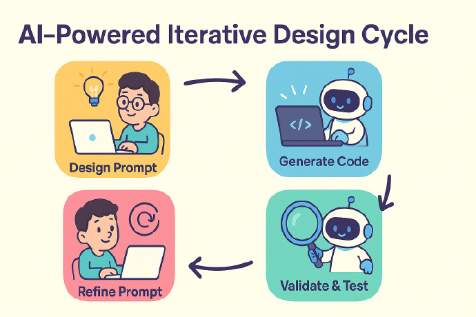

## AI 工具

### GPT 对话生成


### 编程工具

- Copilot
- Cursor
  - Claude3.7/4 sonnet
  - Gemini 2.5 pro
- [Gemini CLI](https://github.com/google-gemini/gemini-cli)
- 字节Trae 国际版
- [阿里通义灵码](https://lingma.aliyun.com/)
- 腾讯CodeBuddy
- 百度Comate

Gemini CLI
安装 `npx https://github.com/google-gemini/gemini-cli` 或者 `npm install -g @google/gemini-cli`
运行 `gemini`，选择主题并授权，登录个人谷歌账号进行授权，即可开始使用。
如果需要使用特定模型，或者免费额度不够用，可以去 [Google AI Studio](https://aistudio.google.com/apikey) 生成一个 API Key，通过环境变量配置：`export GEMINI_API_KEY="你的apikey"`
开始使用：登录完成后，输入 gemini 就可以开始正常使用。
Gemini CLI 内置丰富的命令可以使用，详细可以查阅：https://github.com/google-gemini/gemini-cli/blob/main/docs/cli/commands.md
### AI 软件工程
- 原型设计
    - Ready原型（付费）不仅能生成原型，还能生成前端源代码文件
    - 美团Nocode原型，效果一般
    - Figma


### 软件工程

- 需求结构化拆解，把原来的 Word 软件需求规格说明书等需求文档进行结构化拆解，把大文件拆解成一个个小的用户故事或功能点的独立 markdown 文件，纳入软件项目工程统一管理；
- 完整数据库设计
- Cursor Rules 规则设计 [设计架构](./AI_tool_pic/design_as_code.png) 设置了 Cursor Rules 规则，把开发框架、开发语言、软件需求、数据库设计、前后端的编码规范等都提前预设和设计好。

## 提示词

### 绘制结构图
- 技术方案技术书-cursor辅助结构化-图SVG结构化
- Mermaid
- plantuml
- svg 流程图、架构图、集成关系逻辑图

## 知识库
- cherry studio 挂不同大模型
- Ima 知识库


## 深度探索
- Google Gemini DeepResearch

智谱沉思、密塔 AI 深度探索、天工 AI 超级智能体、Kimi 探索版、Coze 空间以及即将推出的 Teamo 深度研究工具。


## AI 智能体
- Coze 扣子
- Dify
  - 企业AI智能库
  - 智能客服
  - 智能问答
- MCP 
  - cursor + MCP
  - cherry studio + MCP

## AI多模态
- AI辅助学习
  - 秘塔AI今天学点啥
    - 辅助培训课件+音频+ppt
    - 英文pdf转中文讲解视频
- AI数字人
  - 真人数字人 HeyGen
  - 卡通数字人 HeyGen + 即梦
- 文转视频（毙掉）
  - 剪映AI文章转视频
- 播客
  - 扣子空间
  - 即梦AI口播
- 图片生成处理
  - 即梦


# AI 编程

如何让AI真正理解项目需求并生成高质量、一致性的代码？
构建一套系统化的AI协作规范

- 如何让AI准确理解业务逻辑和技术要求
- 如何确保生成代码的架构一致性和质量标准
- 如何在团队中推广和维护统一的开发模式
- 如何避免规范冲突和维护成本过高的问题

## Rules 设计理念
[新版本采用清晰的三层架构，每层都有明确的职责和边界](./AI_tool_pic/new_rules_design.png)

### 标准化规则格式
```md
# 规则名称

## 基础规范
- 明确的技术要求和实现标准

## 强制行为
- 必须执行的具体操作和约束

## 禁止行为  
- 严格禁止的操作和做法，需要避免的常见错误

## 示例代码
- 具体的代码示例和最佳实践
- 也通过 [文件名](mdc:路径) 引用外部示例
```

### 明确的AI协作协议提示词
[AI协作协议提示词](./AI_tool_pic/ai_portal_prompt.png)

```md

# AI协作执行规则

## 规则分类
- basic/下的通用规则: 必须调用，通用基础规范
- modules/下的模块规则: 按需调用，架构分层规范  
- workflow/下的流程规则: 按需调用，业务场景规范

## 执行流程
1. 识别场景 → 调用相关规则
2. 读取示例代码 → 作为生成参考
3. 执行强制/禁止行为 → 确保代码质量
4. 应用设计原则 → 组件化、单一职责、分层设计

## 质量保障
- 所有规则必须100%执行，重点关注强制行为和禁止行为
```

## 三层结构
- 基础层精细化设计
- 模块层的分层设计
- 流程层的场景化设计

### 基础层精细化设计

|      文件名      |      职责      |          核心内容          |
| :--------------: | :------------: | :------------------------: |
|    basic.mdc     |  项目基础规范  | 目录结构、技术栈、开发流程 |
| code-quality.mdc |  代码质量控制  |   复杂度限制、安全性要求   |
|      ts.mdc      | TypeScript规范 |   类型定义、严格模式配置   |
|   comment.mdc    |    注释规范    |   JSDoc格式、文件头注释    |
|  code-names.mdc  |    命名规范    |  变量、函数、组件命名约定  |
|    style.mdc     |    样式规范    |      CSS/Less编写标准      |
|     lint.mdc     |    代码检查    |    ESLint、Prettier配置    |

`code-quality.mdc` 代码质量
```md
# 代码质量分规范（通用规则）

## 强制行为

- 所有请求必须采用 HTTPS 协议
- 确保第三方库安全可靠

## 禁止行为

- 代码复杂度限制
  - 单个文件不得超过 500 行
  - 条件复杂度不得超过 10
  - 单个函数不得超过 199 行
  - 超过限制时，应优先按功能模块拆分为多个函数或文件
- 禁止使用非得物域名的外部 CDN 资源
- 禁止在代码中包含明文密码或硬编码 token
- 禁止出现敏感词
- 避免重复代码块
- 不允许单词拼写错误或不符合命名规范
- 避免在前端直接进行金额计算(导致精度丢失)
- 禁止使用魔数(如 a === '3')，应使用常量(如 a === statusMap.login)
```

### 模块层的分层设计
模块层的设计遵循前端分层架构思想，将复杂的应用拆分为职责明确的模块：
- 表现层： `components.mdc`（组件规范）、`pages.mdc`（页面规范）
- 业务逻辑层： `hooks.mdc`（状态管理）、`utils.mdc`（工具函数）
- 数据服务层： `service.mdc`（API接口）、`constants.mdc`（配置管理）
- 路由层： `route.mdc`（路由配置和导航）

服务层规范（`service.mdc`）规范定义了API接口的标准化开发流程：

```md

# API接口生成规范（模块规则）

## 存放位置规范（按优先级）
- [p0] 页面级API：src/pages/{pageName}/services/{modules}.ts
- [p1] 全局API：src/services/{modules}.ts
- 类型文件：对应的 .interface.ts 文件

## 标准代码模板
"""
import { request } from '@/utils/request';
import { UniversalResp } from '@/utils/request-operation';
import { IUserListReq, IUserListDataRes } from './interface';

/**
 * 获取用户列表
 * @param data 请求参数
 */
export const fetchUserListApi = async (data: IUserListReq) => {
  return 
            request.post>(
          
    '/api/user/list',
    data
  );
};
"""
## 强制行为
- 使用MCP Server的mooncake_get_api_details工具获取接口详情
- 响应数据必须使用UniversalResp<T>泛型包装
- 接口命名采用fetch{ApiFileName}Api格式
- 类型定义必须完整，包含完整字段注释
```

### 流程层的场景化设计
针对具体业务场景定制化规范，将复杂的业务场景标准化。
|      流程文件      |      业务场景      |          核心功能          |
| :----------------: | :---------------: | :------------------------: |
| curd-page.mdc       |  curd页面开发   |   curd页面完整使用流程   |
| log.mdc             |  错误监控   |   APM监控和错误日志处理流程   |
| send-buried.mdc |  数据埋点   |   用户行为埋点的标准流程   |

`curd-page.mdc`  定义了完整的表格页面开发流程：


```md
# pro-table生成新页面（流程规则）
深入研究代码并理解[insert feature]是如何工作的。一旦你明白了，让我知道，我将提供我的任务给你。

##  工作流程
按以下流程进行任务执行，如果评估存在非必须流程，可跳过。
- MCP读取接口信息
- 从用户输入中提取以下信息：
   - 列表名称
   - 筛选项（需标记hideInTable）
   - 展示项（需标记hideInSearch）
   - 操作项
   - 工具栏按钮
- 评估完整的需求内容复杂度，考虑未来的扩展性，合理设计分层目录结构
    - 各个模块保持单一职责，考虑合理的业务组件拆分，避免大量代码都在页面主入口文件
    - 使用命令行批量创建目录文件（包含各类文件ts、tsx、less等）
    - 文件暂不生成代码
- 配置页面的路由信息
- 生成类型文件，确保所有类型定义清晰
- 生成constants文件，定义所需常量
- 生成services文件，实现数据服务
- 生成所需的 hooks 文件
- 生成页面（必需）和components（如需）文件 完成UI层

## 强制行为
- 使用pro-table进行开发，包括筛选表单，符合最佳实践
- 筛选项和列表项配置创建 useColumns.tsx 声明，筛选项（需标记hideInTable）、展示项（需标记hideInSearch）
          
- 左侧字段按需固定，操作项右侧固定，最多显示两个，超出折叠显示
- 文本左对齐，数字右对齐，状态枚举居中显示
- 分页设置支持10、20、50、100
- .....

# 禁止行为
.....
```

## 最佳实践
1. 创建基础架构
```md
.cursor/rules/
├── ai.mdc              # AI协作总纲
├── basic/              # 基础规范目录
│   ├── basic.mdc
│   ├── code-quality.mdc
│   ├── ts.mdc
│   ├── style.mdc
│   ├── comment.mdc
│   ├── code-names.mdc
│   └── lint.mdc
├── modules/            # 模块规范目录
│   ├── components.mdc
│   ├── pages.mdc
│   ├── hooks.mdc
│   ├── service.mdc
│   ├── constants.mdc
│   ├── utils.mdc
│   └── route.mdc
└── workflow/           # 流程规范目录
    ├── curd-page.mdc
    ├── log.mdc
    └── send-buried.mdc
    └── ......
```
2. 配置AI协作协议，在 `ai.mdc` 中定义核心协作规则
```md
# AI协作执行规则

## 规则分类
- basic/下的通用规则: 必须调用，通用基础规范
- modules/下的模块规则: 按需调用，架构分层规范  
- workflow/下的流程规则: 按需调用，业务场景规范

## 执行流程
1. 识别场景 → 调用相关规则
2. 读取示例代码 → 作为生成参考
3. 执行强制/禁止行为 → 确保代码质量
4. 应用设计原则 → 组件化、单一职责、分层设计

## 质量保障
所有规则必须100%执行，重点关注强制行为和禁止行为
```
3. 分阶段实施计划
|    阶段    |      目标      |            关键活动            |
| :--------: | :------------: | :----------------------------: |
|  试点阶段  | 验证规范有效性 |  选择1-2个项目试点，收集反馈   |
|  优化阶段  |  完善规范内容  | 根据试点反馈优化规范，开发工具 |
| 标准化阶段 |  形成团队标准  |  制定团队级标准，持续改进机制  |

## 具体实践
这里的“提示词”充当的就是以前的“详细设计文档”的作用，但是可以简化许多，只要 AI 能看得懂就行，怎么写都可以

采用这种模式开发，需要注意一次不要生成太多代码，不然就可能会失控。


除此之外，还需要在开发工具和流程上配合

首先你得有源代码管理，每次 AI 的变更都记录下来。

因为 AI 生成后的代码，很多时候我们不是继续修改，而是重新调整提示词，回滚后重新生成。AI 生成代码更多会变成像 AI 画图，不停的生成新版本，不满意调整提示词重新生成，或者换一个模型重新生成，而不是基于一个错误的结果反复 PUA AI 让它修改，因为一旦 AI 生成错了，那么错误的结果会影响到后续的生成，**不要把它真的当成有智能的无所不能的生物，而是要把它看作一个概率生成工具，错误的结果会继续放大错误的概率。**

记住一个原则：**小错误才继续修复，稍微大一点错误直接回滚修改提示词或者换模型后重新生成，不要舍不得那点 Tokens，比起浪费的时间来不值钱。**

测试也很重要，单元测试这种用例是要自己设计自己review的，手工测试也必不可少，尽可能让测试成本降低，比如通过命令行去测试、测试代码去测试，这样每次生成完都可以马上测试马上验证，有问题就回滚或者修复。



先设计 -> 写代码 -> 改进设计 -> 写代码。
1. 先设计，把设计结果写成简单的AI看得懂的提示词
2. 用提示词生成代码
3. 验证生成的结果
4. 根据验证测试的结果去调整设计和提示词，重新生成