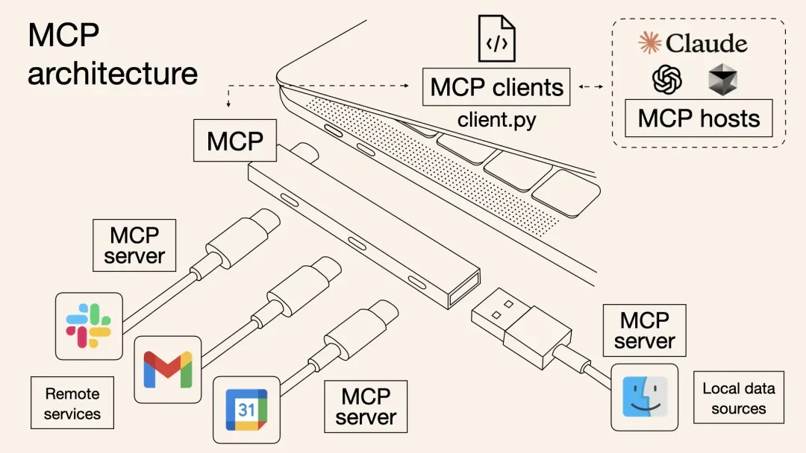

# 关于 MCP 我所知道的

## MCP 是什么？

是一种协议（MCP：model context protocol），用来规范大语言模型和外部工具之间的通信。

就像电脑上的 USB 协议，有了 USB 协议，电脑就可以接上各种外接设备。比如

- 摄像头，可以录视频；
- 扫描仪，可以扫描文档；
- 网卡，可以上网。

这个例子已经烂大街了，所以不做赘述，接下去讲讲这意味着什么？

意味着两件事

### 1. 从被动等待调用变成主动出击

大模型从以前被动的等待 AI Agent 调用，变成了主动出击，去调用需要的工具或资源。

举个例子：

大模型无法获取私有知识库的内容或者实时发生的信息内容（比如查天气、读数据库），我们就需要自己写代码去获取外部数据和工具，再把结果送回大模型处理。这样处理虽然能解决问题，但大模型全程就像个听话的「工具人」，只会根据程序员写的指令被动配合。真正烧脑的活儿——比如怎么拆分任务、先做什么后做什么、遇到问题怎么解决——其实全得靠程序员在编排的过程中提前想好对策。**大模型本身的深度思考和深度推理价值并没有真正发挥出来。**

### 2. 解耦模型与工具的依赖关系

**在 MCP 出来之前**，大模型要调用外部工具（API）最简单的是利用大模型本身的 Function Calling 功能，比如查询天气，但问题在于没法复用，我写好一个查询天气的 tools，你要用可能还要写一遍，这时候 MCP 就提出来了，大家都遵循统一的协议，一个人写好了一个工具，发布出来作为 MCP server，其他人只需要按协议写个客户端调用就可以复用了。

大模型本身不可能对于不同的用户都去单独定制和开发不同的 Function Call 来获取资源，用户也不可能基于不同的 AI 应用不断的开发和企业内部资源工具对接的各种 Function Call 接口。

| 对比维度         | Function Call                          | MCP                                   |
| ---------------- | -------------------------------------- | ------------------------------------- |
| **连接方式**     | 点对点定制化连接（类似不同的电器插头） | 标准化协议接口（类似 USB-C 统一接口） |
| **通信模式**     | 单向请求-响应机制                      | 双向互动对话机制                      |
| **上下文管理**   | 单次会话级状态保持                     | 跨会话持久化上下文跟踪                |
| **开发成本**     | 每个对接需编写独立代码（O(n)复杂度）   | 一次开发多场景复用（O(1)复杂度）      |
| **安全合规**     | 分散管控                               | 统一策略框架                          |
| **开发者友好度** | 每次 O(n)投入                          | 一次开发 N 次复用                     |

MCP Sever 能力接入可以穷举，但是 AI Agent 定制化开发难以穷尽，一个个去开发 Agent 思路将被淘汰，这个本质仍然是开发了大量上层的 AI 应用信息孤岛。

## 技术原理

- 客户端层
  - 组成：集成于 AI 应用（如 Claude Desktop、Spring AI）中的协议接口
  - 功能：向 MCP 服务器发起请求，传递用户指令与上下文信息，例如“查询数据库中的订单数据”
- 服务器层
  - 资源管理器：连接本地文件、数据库（如 PostgreSQL）或远程 API（如 GitHub）
  - 权限控制：通过 OAuth 2.0 等机制管理数据访问权限
  - 协议转换器：将不同数据源格式统一为 MCP 标准化结构
  - 技术特性：支持本地部署与远程连接，计划强化无状态服务支持
- 数据源层
  - 本地资源：文件系统、SQLite 数据库、开发环境配置等
  - 远程资源：企业级 API（如 Jira、Salesforce）、云存储（如 Google Drive）
  - 安全机制：通过沙盒隔离技术防止数据泄露，例如医院场景中屏蔽患者隐私字段

## 展望

构建的工具要考虑模型演进，如果你的工具在模型演进之后失去意义了，那么即是坏选择，如果模型越好，你的工具越好，就是好选择。

我们在制作 AI 应用的重点不要放在上层 AI 智能体的开发、具体的应用场景，虽然这个看起来可能见效快，但是这种大量的 AI 智能体和传统的单体应用小烟囱没有太大的区别，仍然是一个个的信息孤岛。

更应该思考如何构建一个通用 AI 智能底座，如何将已有的私有能力在确保数据安全性的情况下，能够通过 MCP Server 接入大模型。

## 案例

### 

环境：
- 类 VScode 编辑器，cursor\trae 等
- 安装插件 cline

## 其他引用和参考资料

- [MCP Server](https://mcp.so/) 目前已收录 2600 多个 MCP Server
- [Model Context Protocol servers](https://github.com/modelcontextprotocol/servers) MCP 服务器合集

[MCP + 数据库，一种比 RAG 检索效果更好的新方式！](https://mp.weixin.qq.com/s/jV46NMDfcJRiklUG_RLsmQ)

视频
- [开挂体验+1，通过MCP光速建站，毫秒级访问](https://www.bilibili.com/video/BV157dJYbEti)
- [一口气介绍15种MCP工具，CherryStudio配置MCP](https://www.bilibili.com/video/BV1MjZ5YrESn/)
- [我被AI智能体整破防！如何像搭积木一样构建Agent](https://www.bilibili.com/video/BV1F7XzYJEYd/)

推荐一个目前看到最系统+详细的良心MCP免费教程（by 同济子豪兄），大家想看的AI控制unity，figma，blender的案例里边都有。https://zihao-ai.feishu.cn/wiki/TLEnwPkI1iIHglkgEtQcObLgnSe

https://juejin.cn/post/7490462400614826024

[详解 MCP 传输机制](https://mp.weixin.qq.com/s/gmgo_glOzbvdFwePP1yQ9g)

[详解 MCP 连接生命周期](https://mp.weixin.qq.com/s/lJHiT-iaecqhcR55fz4G1Q)

[详解 MCP 核心架构](https://mp.weixin.qq.com/s/uTsr06MnJ9t3sGDzLD99_g)
