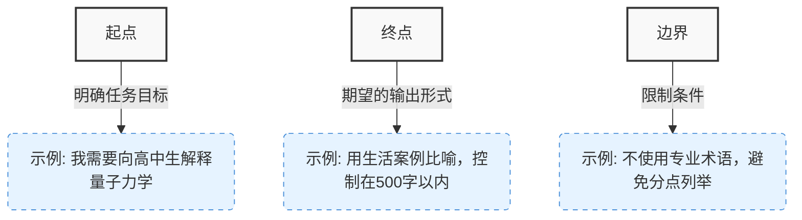

# 一文掌握 DeepSeek 全部使用方案：从免费资源到本地部署，再到 API 调用

随着 DeepSeek 的日益火热，官网经常出现繁忙状态。为了方便大家使用 DeepSeek R1，本文整理了多种使用途径，包括直接使用、本地部署、API 调用以及联网搜索等方案。其中，API 调用方式是最推荐的使用方式。

## 可以直接使用的资源

- 【搜索】秘塔搜索 https://metaso.cn/
- 【搜索】Perplexity AI https://www.perplexity.ai/
- 【聚合】Monica https://poe.com/DeepSeek-R1
- 【聚合】POE https://poe.com/DeepSeek-R1

### 【搜索】 秘塔搜索

> https://metaso.cn/

秘塔搜索提供了基于 DeepSeek 的搜索服务，但存在以下限制：

1. 需要登录才能使用
2. 仅支持单轮对话，主要用于搜索，不具备上下文记忆功能

### 【搜索】Perplexity AI

> https://www.perplexity.ai/

作为一个强大的 AI 搜索引擎，但有以下使用限制：

1. 需要登录账号
2. 需要科学上网
3. 免费版有使用次数限制

### 【聚合】Monica

> https://monica.im/home/chat/Monica/monica

提供多模型聚合服务，但主要缺点是：

- 付费较贵

### 【聚合】POE

> https://poe.com/DeepSeek-R1

同样提供多模型聚合服务，但：

- 付费价格较高

## 本地部署方案

### LMStudio

LMStudio 支持本地部署 DeepSeek-R1 模型，并可以部署 API 接入 IDE。

下载地址：https://lmstudio.ai/docs

由于 LMStudio 默认使用 Hugging Face 平台下载模型，国内用户需要配置镜像源：

1. 需要修改的文件：

   - `LMStudio文件位置\resources\app\.webpack\renderer\main_window.js`
   - `LMStudio文件位置\resources\app\.webpack\main\index.js`

2. 将所有 `https://huggingface.co/` 替换为 `https://hf-mirror.com/`

3. 重启 LMStudio 后：
   - 点击左侧放大镜按钮
   - 搜索框输入 "r1"
   - 选择搜索结果进行下载

#### API 部署步骤

1. 点击主界面第二个按钮进入开发者界面
2. 开启 API 部署服务
3. 在 Settings 中启用所有选项（确保 Windows WSL 可访问）

### Ollama

下载地址：https://ollama.com/download

部署步骤：

1. 安装验证：命令行输入 `ollama` 确认安装成功

2. 拉取模型：

```bash
# 拉取 DeepSeek R1 模型
ollama pull deepseek-r1:1.5b
# 拉取文本嵌入模型
ollama pull nomic-embed-text
```

3. 启动服务：
   - 模型将在 localhost:11434 上自动启动
   - 运行命令：`ollama run deepseek-r1:1.5b`

## API 调用方案（推荐）

相比本地部署，API 调用方式更适合实际工作场景。以下是推荐的工具和平台：

### 本地工具

- Anything LLM：https://anythingllm.com/desktop（个人使用体验良好）
- Cherry Studio：https://cherry-ai.com/（界面设计优雅）
- Chatbox：https://chatboxai.app/zh

### API 服务提供商

- 硅基流动：https://cloud.siliconflow.cn/models
- 火山引擎：https://console.volcengine.com/ark/region:ark+cn-beijing/experience/chat
- AskManyAI：https://askmanyai.cn/login 免费，联网搜索 + 图片对话 + 文件上传
- OpenRouter：https://openrouter.ai/
- 阿里云百炼：https://api.together.ai/playground/chat/deepseek-ai/DeepSeek-R1
- 腾讯云：https://console.cloud.tencent.com.cn/tione/v2/aimarket
- Groq：https://groq.com/（基于 Ollama 70B 模型蒸馏）

使用流程：注册账号 → 生成 API Key → 配置本地工具 → 选择模型 → 开始对话

##### 硅基流动

> https://cloud.siliconflow.cn/models

特点：

- 免费额度：约 1000 次对话
- 在线试验场不支持保存历史记录

##### 火山引擎

> https://console.volcengine.com/ark/region:ark+cn-beijing/experience/chat

优势：

- 上下文长度充足
- 响应稳定

限制：

- 使用额度有限

##### OpenRouter

> https://openrouter.ai/

优势：

- 免费使用

限制：

- 不支持联网
- 需要注册
- 服务稳定性待改善

### 推荐组合

> 推荐搭配：
>
> - 工具：[Cherry Studio](https://cherry-ai.com/)
> - 接口：[火山引擎-火山方舟](https://console.volcengine.com/ark/region:ark+cn-beijing/experience/chat)

## 联网搜索配置

> 环境要求：Miniconda/pyenv

配置步骤：

1. 使用 Conda 创建 Python 3.11 环境：

   ```bash
   conda create -n webui python=3.11
   conda activate webui
   pip install open-webui
   ```

2. 启动服务：
   ```bash
   open-webui serve
   ```

## 模型能力测试

### 测试一：24 点游戏

规则：

- 随机抽取 4 张扑克牌（可重复）
- 仅可使用加(+)、减(-)、乘(×)、除(÷)运算
- 每张牌必须且只能使用一次
- 计算结果需等于 24

测试数据：

- 第一组：3, 6, 7, 5
- 第二组：9, 1, 5, 4

### 测试二：网络梗理解

要求：用一个字回答"什么你太美"（禁止搜索）

## 如何编写推理型AI提示词

### 什么情况需要推理模型？
想象你要训练一个AI侦探，有两种教学方法：
- **填鸭式教学**：手把手教破案步骤（对应SFT模型）
- **实战演练**：只给案件线索让AI自己推理（对应RL模型）

#### ▶ 最适合召唤「AI侦探」的5大场景
1. **烧脑的智力题**：需要逻辑推导的数学证明、哲学思辨
2. **迷宫式任务**：处理包含10+步骤的复杂流程（如产品设计评审）
3. **灰度决策**：没有标准答案的道德困境（如自动驾驶伦理问题）
4. **信息迷宫**：从海量非结构化数据中提炼洞见

#### ▶ 别让AI做「大材小用」的事
- 需要即时反馈的对话场景
- 查快递单号这类简单查询，纯信息型查询易产生幻觉
- 有明确操作手册的流程性任务，过于简单的任务可能导致过度思考

### 三招设计「推理友好型」提示词

#### 第一式：目标定位三部曲

把握以下三个要素能显著提升输出质量：



#### 第二式：黄金公式
```
角色皮肤 + 任务靶心 + 安全护栏 + 呈现模板 = 专业级提示词
```

| 组件       | 功能说明                  | 示例片段                          |
|------------|--------------------------|----------------------------------|
| 角色皮肤   | 激活专业知识库           | "作为诺贝尔奖得主..."           |
| 任务靶心   | 定义成功标准             | "设计含5个指标的评估体系..."    |
| 安全护栏   | 避免跑偏                 | "排除技术可行性讨论..."         |
| 呈现模板   | 控制输出结构             | "用SWOT框架呈现..."             |

#### 第三式：迭代心法
1. 先给基础指令看反应
2. 像调教实习生一样补充要求
3. 关键结论要三重验证

### 避坑指南：90%的人都踩过这些雷

#### ❌ 新手常见误区
- 过度控制：像写代码一样规定每个步骤
- 模糊指令："请专业点"这类无效要求
- 信息过载：一次性塞入10+个要求

#### ✅ 高手这样做
1. 用具体数字量化目标
   - 差："分析市场趋势"
   - 优："找出近3年增长最快的3个细分市场"

2. 迭代优化
   1. 从零样本开始，必要时再添加示例
   2. 根据初始结果调整提示词
   3. 对重要结论进行多轮验证

3. 动态调整策略
   ```markdown
   首要目标：设计智能家居系统
   阶段分解：
   1. Phase1：列出用户核心需求（今日完成）
   2. Phase2：根据需求匹配技术方案（明日进行） 
   动态规则：若识别到老年用户需求，增加适老化设计模块
   ```

### 实战案例库

#### 案例1：物理科普写作
```markdown
[角色] 费曼式科普作家
[目标] 用1个体育类比解释量子隧穿（200字）
[限制] 避开数学公式，突出概率概念
[呈现] 结尾要有引发思考的提问
```

#### 案例2：技术文档翻译
```markdown
请尊重原意，保持原有格式不变，用{简体中文}重写内容
[要求]
1. 英文人名以及专业术语保持不变
2. 代码片段维持原格式
```

#### 案例3：伦理风险评估
```markdown
作为技术伦理委员会主席，你需要构建自动驾驶伦理决策树，要求：
1. 覆盖碰撞场景中的5类利益相关方
2. 量化不同决策的道德权重（0-10分）
3. 排除法律合规性讨论
输出格式：Markdown流程图 + 配套注释
增强要求：对权重赋值逻辑进行概率敏感性分析
```

### 进阶工具箱

#### 检查清单
- ✅ 是否允许模型自主规划解决路径？
- ✅ 是否存在模糊的成功标准？
- ✅ 是否包含冗余的过程控制？
- ✅ 是否预设了思维步骤？

## 更多集成方案

> 详见：[DeepSeek 官方集成方案](https://github.com/deepseek-ai/awesome-deepseek-integration/blob/main/README_cn.md)

## 接入 agent

### 如何构建靠谱的 AI agent？

> https://www.anthropic.com/research/building-effective-agents

这是一篇来自于 Anthropic Claude 团队的座谈交流。他们围绕 agents 的定义、实践经验与未来展望展开了一个深入对话。

文章从理论到实践全面阐述了 AI agent 的开发要点：

1. 首先明确区分了 agent 和工作流的本质区别，agent 具有自主决策能力而非简单的固定流程；
2. 在代码实现层面，详细对比了工作流的线性特征和 agent 的灵活性；同时强调了开发者需要深入理解模型视角，在设计时保持同理心。
3. 在工具设计方面，文章指出了开发者常见的忽视工具接口友好性的误区。
   对于 agent 的应用前景，文章认为目前消费级 agent 被过度炒作，存在偏好表达复杂和风险控制等挑战，而企业级应用则更具潜力，特别适合自动化重复性任务。
   最后，专家们建议开发者建立完善的度量体系，并着眼于开发能随模型进步而持续改进的产品。

我印象比较深刻的有三句话：

1. Agents 不是工作流，而是管理工作流的自动化流程；
2. 对 Agents 工作要有同理心，人要站在机器的视角考虑流程是否奏效；
3. 最后一句，是奥特曼也说过很多次的，构建的工具要考虑模型演进，如果你的工具在模型演进之后失去意义了，那么即是坏选择，如果模型越好，你的工具越好，就是好选择。

### Dify 知识库搭建
```sh
# mac os
# 克隆 Dify 源代码至本地环境。
git clone https://github.com/langgenius/dify.git

# 进入 Dify 源代码的 Docker 目录
cd dify/docker

# 复制环境配置文件
cp .env.example .env
```
启动 Docker 容器（需要先安装 Docker）
```sh
docker compose up -d
# 如果版本是 Docker Compose V1，使用以下命令：
docker-compose up -d
```
Dify 创建聊天
访问http://localhost/（默认 80 端口） 进入 dify

首次进入初始化设置账号密码

点击 Dify 平台右上角头像 → 设置 → 模型供应商，选择 Ollama，轻点“添加模型”。

Dify 知识库创建
主页选择 知识库 -> 创建知识库 -> 上传知识 -> 等待处理完成